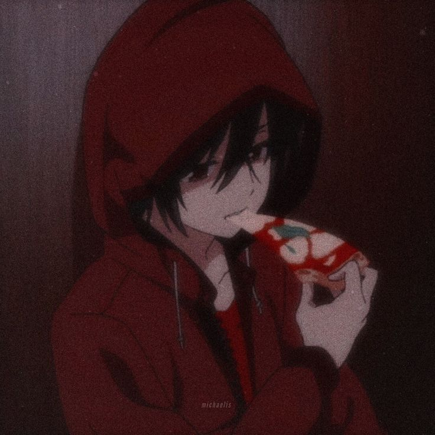
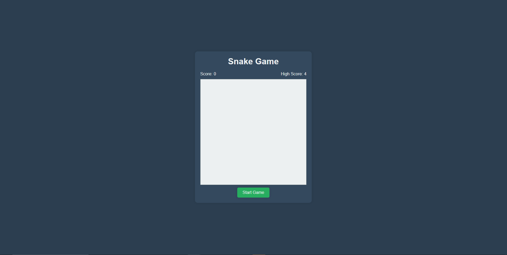

 

  

  <h3 align="center">Simple Game Website</h3>

  

    A fun way to enjoy simple games when your bored!
     
     
    <a href="https://github.com/NickRobin23/NickRobin23.github.io"><strong>Explore the docs »</strong></a>
     
     
    <a href="https://NickRobin23.github.io">View Demo</a>
    .
    <a href="https://github.com/NickRobin23/NickRobin23.github.io/issues">Report Bug</a>
    .
    <a href="https://github.com/NickRobin23/NickRobin23.github.io/issues">Request Feature</a>
  

    

## About The Project

This is a fairly simple site coded using HTML, CSS, and Javascript to make simple games accessible all in one website. In the future, there will be matching games, snake, and more!

Here's why:

* This website can be used among friends to try and beat each other's high scores and/or easily access games everyone loves to play
* Who doesnt love playing fun games in one simple site
* Well... So you can have fun :smile:

Of course, these games can be found on other websites but not found as easily and in one place as my website is able to provide.

## Built With

This website was build using the following languages:
* HTML
* CSS
* Javascript

## Getting Started

Simply type the website into your browser's search bar and start playing!

## Usage

The Up, Down, Left, and Right Arrow Keys are used to control the snake while playing. 

## Roadmap

See the [open issues](https://github.com/NickRobin23/NickRobin23.github.io/issues) for a list of proposed features (and known issues).

## Contributing

Contributions are what make the open source community such an amazing place to be learn, inspire, and create. Any contributions you make are **greatly appreciated**.
* If you have suggestions for adding or removing projects, feel free to [open an issue](https://github.com/NickRobin23/NickRobin23.github.io/issues/new) to discuss it, or directly create a pull request after you edit the *README.md* file with necessary changes.
* Please make sure you check your spelling and grammar.
* Create individual PR for each suggestion.
* Please also read through the [Code Of Conduct](https://github.com/NickRobin23/NickRobin23.github.io/blob/main/CODE_OF_CONDUCT.md) before posting your first idea as well.

### Creating A Pull Request

1. Fork the Project
2. Create your Feature Branch (`git checkout -b feature/AmazingFeature`)
3. Commit your Changes (`git commit -m 'Add some AmazingFeature'`)
4. Push to the Branch (`git push origin feature/AmazingFeature`)
5. Open a Pull Request

## Authors

* **Robin** - *New Coder* - [Robin](https://github.com/NickRobin23) - *Main Game/Site Functionality*
